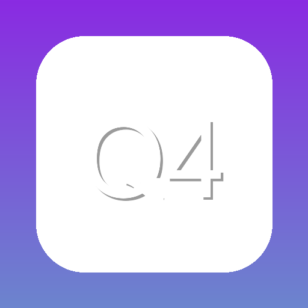

<div align="center">
    
    <h1>QuadDown</h1>
    <p><em>The best way to test games before you buy them.</em></p>
    <p>
        <a href="https://discord.gg/ap6W3xMTKW"></a>
        <a href="https://github.com/tagoWorks/QuadDown/releases/latest"></a>
         
        <a href="./LICENSE"></a>
    </p>
    <p>
        <a href="https://github.com/tagoWorks/QuadDown/issues"></a>
        
        
        <a href="https://github.com/tagoWorks/QuadDown/network/members"></a>
        <a href="https://github.com/tagoWorks/QuadDown/stargazers"></a>
    </p>
</div>

## 🎮 About

QuadDown simplifies your game management experience by providing a seamless way to discover, organize, and test pre-installed games. No more hassle with extracting, installing, or moving files. The game library is powered by a custom webscraper, currently featuring titles mainly from [STEAMRIP](https://QuadDown.app/sources/steamrip) with plans to expand to more sources.

### 👥 Community

- [Join the Discord](https://QuadDown.app/discord) for discussions and support
- [Submit feedback for QuadDown](https://QuadDown.app/feedback)
- [Read the latest changelog](https://QuadDown.app/changelog)
- [Check latest releases on Github](https://github.com/tagoWorks/QuadDown/releases)

## ✨ Features

- 🚀 **Seamless Downloads**

  Lightning-fast 2 click download for games that support it. No browser needed at all.

- 🎵 **Crisp Soundtracks**

  Listen to and download high quality tracks from the games soundtrack tab.

- 🔌 **Game Information**

  View game info, including the game's story, soundtrack, and more with QuadDown Xtra.

- 🌐 **Browser Integration**

  Seamlessly integrate with your browser for one-click game downloads and management.

- 🎨 **Theme Customization**

  Beautiful, appealing themes to choose from for a truly unique experience.

- 🕑 **Local Indexing**

  Search for games at crazy speeds and refresh whenever you want.

- 👤 **Your own username**

  Personalize your username for online game cracks that support it.

- 🌍 **105 Languages Support**

  Full interface support for 105 different languages, making QuadDown accessible worldwide.

<details>
<summary>See the 12 base languages</summary>

These languages come with the app by default:

- English
- Spanish
- French
- German
- Italian
- Chinese
- Arabic
- Hindi
- Bengali
- Portuguese
- Russian
- Japanese

<details>
<summary>Want to see the full list?</summary>

- Afrikaans
- Albanian
- Amharic
- Armenian
- Azerbaijani
- Basque
- Belarusian
- Bulgarian
- Bosnian
- Catalan
- Cebuano
- Chichewa
- Chinese (Traditional)
- Corsican
- Croatian
- Czech
- Danish
- Dutch
- Esperanto
- Estonian
- Filipino
- Finnish
- Frisian
- Galician
- Georgian
- Greek
- Gujarati
- Hausa
- Hawaiian
- Hebrew
- Hmong
- Hungarian
- Icelandic
- Igbo
- Indonesian
- Irish
- Javanese
- Kannada
- Kazakh
- Khmer
- Korean
- Kurdish
- Kyrgyz
- Lao
- Latin
- Latvian
- Lithuanian
- Luxembourgish
- Macedonian
- Malagasy
- Malay
- Malayalam
- Maltese
- Maori
- Marathi
- Mongolian
- Myanmar (Burmese)
- Nepali
- Norwegian
- Pashto
- Persian
- Polish
- Punjabi
- Romanian
- Samoan
- Scottish Gaelic
- Serbian
- Sesotho
- Shona
- Sindhi
- Sinhala
- Slovak
- Slovenian
- Somali
- Sundanese
- Swedish
- Swahili
- Tajik
- Tamil
- Telugu
- Thai
- Turkish
- Ukrainian
- Urdu
- Uzbek
- Vietnamese
- Welsh
- Xhosa
- Yiddish
- Yoruba
- Zulu

</details>

</details>

## 🖼️ Preview App Pages

<details>
<summary>Dropdown all pages</summary>
<div style="display: flex; flex-wrap: wrap; justify-content: center;">
  <div style="margin: 1%; width: 24%;">
    <h3 style="text-align: center;">Home Page</h3>
    
  </div>
  <div style="margin: 1%; width: 24%;">
    <h3 style="text-align: center;">Search Page</h3>
    
  </div>
  <div style="margin: 1%; width: 24%;">
    <h3 style="text-align: center;">Download Game</h3>
    
  </div>
  <div style="margin: 1%; width: 24%;">
    <h3 style="text-align: center;">Game Metadata</h3>
    
  </div>
  <div style="margin: 1%; width: 24%;">
    <h3 style="text-align: center;">Library</h3>
    
  </div>
  <div style="margin: 1%; width: 24%;">
    <h3 style="text-align: center;">Play Game</h3>
    
  </div>
  <div style="margin: 1%; width: 24%;">
    <h3 style="text-align: center;">Downloads</h3>
    
  </div>
  <div style="margin: 1%; width: 24%;">
    <h3 style="text-align: center;">Profile</h3>
    
  </div>
</div>
</details>

## 📦 The QuadDown Installer

This installer simply downloads the full setup package from GitHub and goes through the installation.
The latest version of QuadDown will always be installed through the tool, but you can download specific
versions directly from the [releases page](https://github.com/QuadDown/QuadDown/releases). It is [open source](https://github.com/QuadDown/installer),
and its file size is smaller than the app's NSIS installer for convenience—making it quicker to download
and easier to distribute.

| File                                                                             | SHA-256                                                          | VirusTotal Results                                                                                                      |
| -------------------------------------------------------------------------------- | ---------------------------------------------------------------- | ----------------------------------------------------------------------------------------------------------------------- |
| [QuadDownInstaller.exe](https://cdn.QuadDown.app/files/QuadDownInstaller.exe) | bfe193fea584a97e06a42ee44a7520e6e5036df1172ea6b29e960e392652249b | [1/72 Detections](https://www.virustotal.com/gui/file/bfe193fea584a97e06a42ee44a7520e6e5036df1172ea6b29e960e392652249b) |

## 🤝 Contributing

Contributing to QuadDown is the best way to get your desired features, bug fixes, or improvements into the official build! When your contribution is accepted, your changes will be prominently featured in the QuadDown changelogs, giving you recognition for your valuable input to the project. Learn how to contribute to QuadDown [here](https://QuadDown.app/docs/getting-started/contributing).

## 📂 Project Structure

The QuadDown project is organized into the following main directories:

### **src/** - Core application logic and UI implementation

- **components/** - Reusable React components for the UI
  - **ui/** - shadcn/ui component library for modern UI elements
- **context/** - React context providers for global state management (authentication, language, settings, themes, tour)
- **hooks/** - Custom React hooks for efficient image loading and caching
- **lib/** - Utility libraries and helper functions
- **pages/** - Main application pages and screens (Home, Library, Downloads, Settings, etc.)
- **public/** - Static assets and public resources
  - **sounds/** - UI sound effects
  - **guide/** - User guide assets
- **services/** - Service modules for external APIs and core functionality (Firebase, game info, downloads, analytics, integrations)
- **styles/** - CSS styling files for animations, menu bar, and scrollbars
- **translations/** - Internationalization files for 12 base languages (English, Spanish, French, German, Italian, Chinese, Arabic, Hindi, Bengali, Portuguese, Russian, Japanese)

### **binaries/** - Prebuilt Python binaries for core functionality

- **QuadDownAchievementWatcher/** - Tracks and monitors game achievements
- **QuadDownCrashReporter/** - Automated crash reporting and diagnostics
- **QuadDownDownloader/** - Multi-threaded game download manager supporting various file hosts
- **QuadDownGameHandler/** - Game execution, process management, and runtime monitoring
- **QuadDownLocalRefresh/** - Local game index refresh and update tool
- **QuadDownNotificationHelper/** - System notification helper for download events

  > ℹ️ **INFO:** The tools below are additional tools that do not come with the official build of QuadDown. Instead, they utilize QuadDown's tool installation feature to install these supplementary tools as needed.

- **QuadDownLanguageTranslation/** - Translation tool used to translate to the additional 93 languages
- **QuadDownTorrentHandler/** - Torrent download functionality

### **electron/** - Electron main process and IPC communication

- **modules/** - Modular IPC handlers and backend logic (configuration, Discord RPC, downloads, games, settings, system utilities, updates, window management, and more)

### **scripts/** - Development and build automation scripts for Windows/Linux builds, translation checking, and code statistics

## 🛠️ Running from Source

For detailed instructions, check out the [Developer Docs](https://QuadDown.app/docs/developer/build-from-source).

### Prerequisites

Before building, ensure you have all required dependencies. [View full requirements](https://QuadDown.app/docs/developer/build-from-source#prerequisites).

### Quick Start

> ⚠️ **WARNING:** Some API features like reporting and analytics services will not work on the public version of the app. Additionally, you will not be able to run games in development mode. Check the [Developer Docs](https://QuadDown.app/docs/developer/build-from-source#important-limitations) for more information.

1. **Clone the Repository**

   ```sh
   git clone https://github.com/QuadDown/QuadDown.git
   ```

2. **Install Node Dependencies**

> **Note:** You can use any package manager you prefer, such as npm, yarn, or pnpm.

Using npm:

```sh
npm install
```

Or using yarn:

```sh
yarn
```

3. **Install Python Dependencies**

   ```sh
   pip install -r requirements.txt
   ```

4. **Run the Development App**

   Using npm:

   ```sh
   npm run start
   ```

   Or using yarn:

   ```sh
   yarn start
   ```

To build the source code into an executable, read the [Developer Docs](https://QuadDown.app/docs/developer/build-from-source).

## 🗺️ Development Roadmap

QuadDown's development roadmap can be found [here](https://QuadDown.app/roadmap).

## 📝 License & Contact

Licensed under [MIT](./LICENSE) - 2026 tagoWorks

### Get in Touch

- Email: [santiago@tago.works](mailto:santiago@tago.works)
- Website: [tago.works](https://tago.works)
- Discord: [Join the community](https://QuadDown.app/discord)

---

<div align="center">
    <sub>Built with ❤️ by <a href="https://tago.works">tago</a></sub>
</div>
